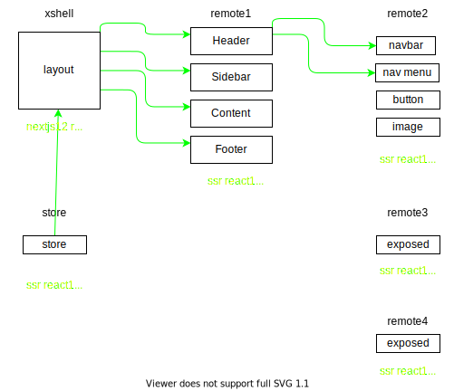

# Training NodeJS
NodeJS Design Patterns and Module Federation


<details><summary>Project Structure</summary>
<p>



#### Ecosystem:
```
shell: SSR server Express 4 + React 18 | Deprecated
xshell: standalone application NextJS 12 + React 18
remote1: standalone application React 18 + Webpack 5
remote2: standalone application React 18 + Webpack 5
store: standalone application React 18 + Webpack 5
```
</p>
<p>

#### Structure:

```
Module Federation Server Side Rendering example using React Suspense.

A basic shell application loading remote components and rendering them server side.

shell is the host application which includes the SSR server.
remote1 standalone application which exposes Content component and consumes Image from remote2
remote2 standalone application which exposes Image component.
store standalone application which exposes Store component.

The remote-app
Within this application, we are exposing a Button component that utilizes a CSS-in-JS design solution.
If you'll notice the shared config, you can see that the version of react and react-dom have been set to 0.
When consuming the remote app within a Next.js environment, we need to make sure that webpack always selects the host's copy of these modules.
By combining the version: '0' syntax with singleton: true we can guarantee that this will be the case.
NOTE: If version: '0' is omitted, you'll encounter an issue where a copy of react will be downloaded from the remoteEntry.

NOTE: Another issue you may run into is an invalid hook call if you are federating a component that uses react hooks. This is directly related to multiple copies of react running at the same time. The above resolves this.

The nextjs-host-app
Within this application, we've configured the remotes object inside of the NextFederationPlugin.
```
</p>
</details>

<details><summary>Development</summary>
<p>

#### Setup repository
```
github clone git@github.com:jozemario/training-nodejs.git
cd training-nodejs/
git checkout develop
```
#### Setup project
```
# Install all the dependencies.
yarn 
# Build the packages
yarn build
# Run in the shell and remote1 and remote2 folders to start the servers
yarn serve

This will build the packages and and serve them on ports 3000, 3001 and 3002 respectively.

localhost:3000 (SHELL)
localhost:3000 (XSHELL)
localhost:3001 (STANDALONE REMOTE1)
localhost:3002 (STANDALONE REMOTE2)
localhost:3003 (STANDALONE STORE)
```
</p>
</details>


